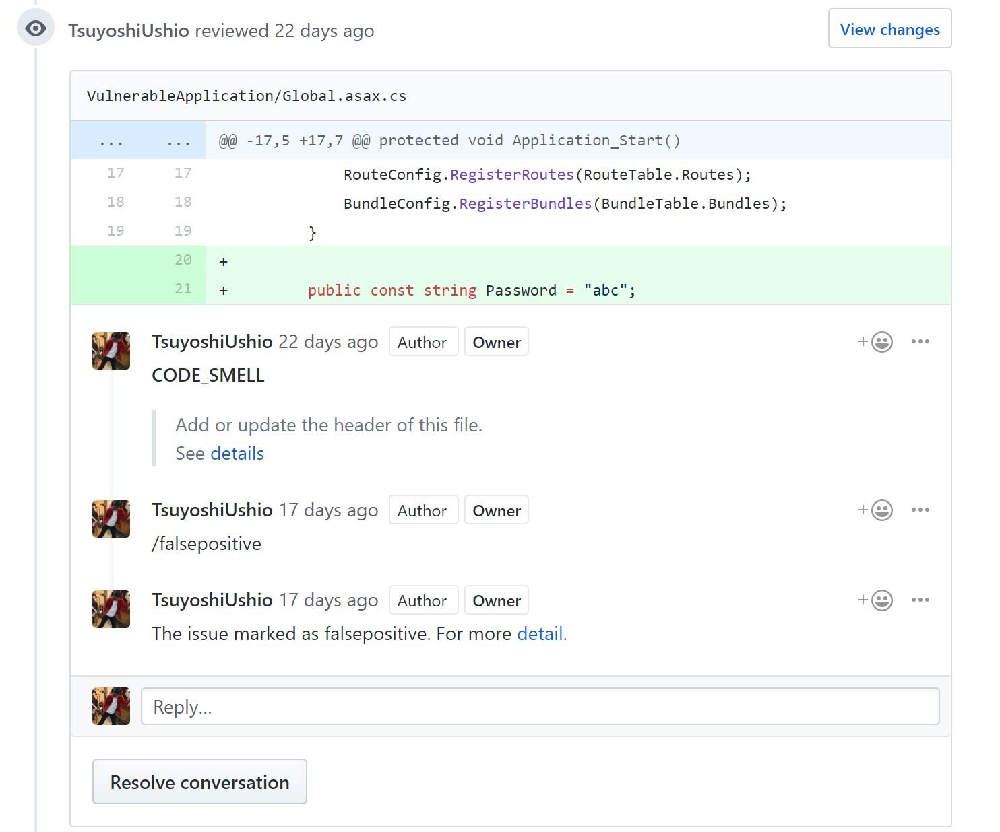
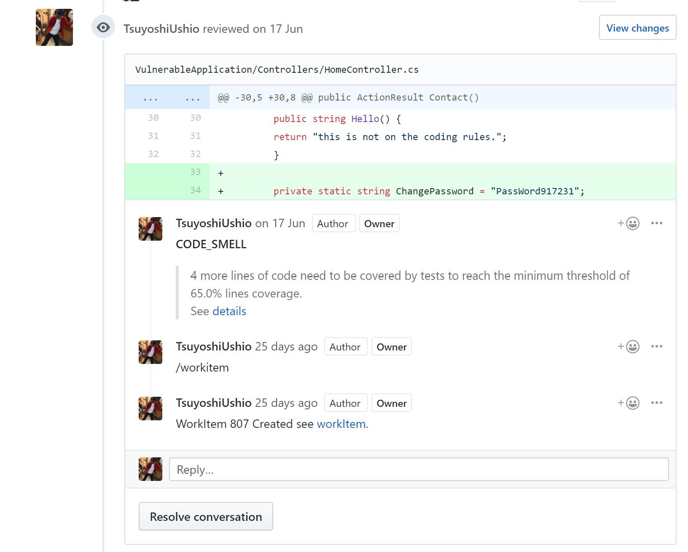
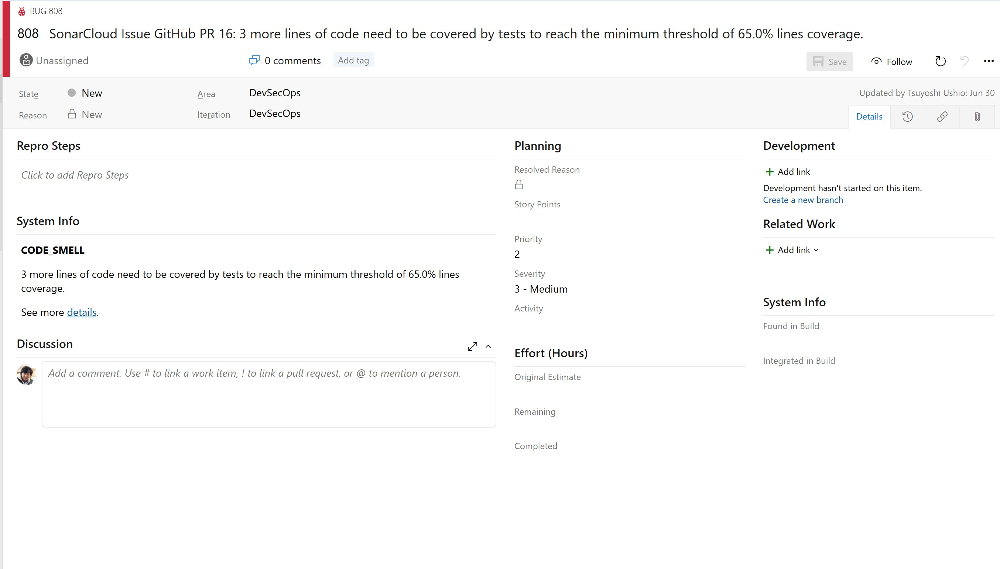

# Security Bot 

This is a bot for help to centerlize the analisys of Security scanning and operations. 

<a href="https://portal.azure.com/#create/Microsoft.Template/uri/https%3A%2F%2Fraw.githubusercontent.com%2FTsuyoshiUshio%2FSecurityBot%2Fmaster%2Fazuredeploy.json" target="_blank">
    
</a>
<a href="http://armviz.io/#/?load=https%3A%2F%2Fraw.githubusercontent.com%2FTsuyoshiUshio%2FSecurityBot%2Fazuredeploy.json" target="_blank">
    
</a>

# Feature

* _Pull Request Decoration_

* _Suppress False Positive_



* _Create WorkItem_



* _Workitem Generated_



# How to use 

## Security Bot configuration

Create Function App and put these configuration on the App Settings. 

| Name | Value |
|------|--------|
|RepositoryProvider|Repository Provider name. Currently "GitHub" is supporeted|
|ScannerProviders| Comma separated Scanner providers list. e.g. SonarCloud, Aqua, WhiteSource and so on. Currently "SonarCloud" is supported.| 
|WorkItemProvider| Providor for WorkItem. Currently "AzureDevOps" is supported|

## Provider Specific configuration

Provider specific configration. If you specify the provider name on the Security Bot configuration part, you need to specify these configrations. 

### GitHub

#### RepositoryProvider

| Name | Value |
|------|--------|
|GitHubPAT|GitHub Personal AccessToken. It requires a permission to  add pull request/issue comment|
|GitHubOwner| GitHub Owner. e.g. this repository's owner is "TsuyoshiUshio"  |
|GitHubRepositoryName| GitHub Repository Name. e.g. this repository's name is "SecurityBot"|

The owner and repository name is used for targeting pull request. In the near future, GitHubRepository name might be removed for support multiple 
projects. If you want to use for GitHub Enterprise, please let me know. 

### AzureDevOps 

#### WorkItem Provider

| Name | Value |
|------|--------|
|AzureDevOpsPAT|Azure DevOps Personal AccessToken. It requires a permission to add work item|
|AzureDevOpsOrganizationURL| URL for the orgranization. e.g.   https://dev.azure.com/yourorg |
|AzureDevOpsProject| ProjectName of Azure DevOpsProject e.g.   SecurityBot if your project url is https://dev.azure.com/yourorg/SecurityBot |

### SonarCloud 

#### Scan Provider

| Name | Value |
|------|--------|
|SonarCloudPAT| SonarCloud personal access token |


## CI configration 

On your CI, please call 'CIHook' Functions. The parameter will be like this. 

### sample script for Azure Pipeline 
This is the sample script using Command line with Azure pipline. 

```bash
echo $(System.PullRequest.IsFork)
echo $(System.PullRequest.PullRequestId)
echo $(System.PullRequest.PullRequestNumber)
echo $(system.pullRequest.sourceCommitId)

curl "http://YOUR_HOST_URL/api/CIHook?pullRequestId=$(System.PullRequest.PullRequestNumber)&projectKey=TsuyoshiUshio_VulnerableApp&commitId=$(system.pullRequest.sourceCommitId)&pullRequestUrl=https://github.com/TsuyoshiUshio/VulnerableApp/pull/$(System.PullRequest.PullRequestNumber)"
```

| Name | Value |
|------|--------|
|pullRequestId|PullRequestId that is included on the pull request url listed below. In case of Azure DevOps, it is called PullRequest Number.|
|projectKey| SonarCloud projectKey of your project |
|commitId| Commit ID of the pull request |
|pullRequestUrl| URL of the pull request|

# Running Locally 

Copy the `local.settings.json.example` to `local.settings.json` fill the value then start on your Visual Studio.  


